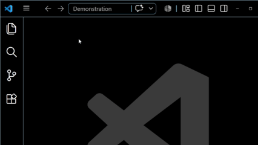
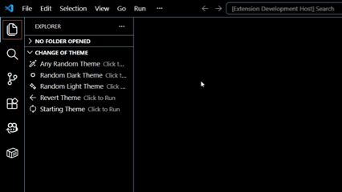

## Change of Theme
Explorer based UI for VS-Code allowing a user to apply themes either **Randomly** or of their specific choosing.

Can't find a theme you like? why not leave it up to random change, and find one you see fit.

## Video Demonstration
### Randomly Select Themes

### Quickly Select Themes

## Why I created this
	I almost always keep open my side panel view to the Explorer's and I would prefer to change & apply themes from there via a UI.

	During long coding sessions I often like to change up the theme I am using to keep myself awake and interested (I still like to program by hand lol).

	VS Code does not have a built in option to access themes from the Explorer's Side Panel, so I created one.